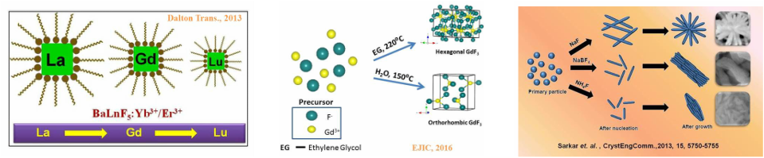
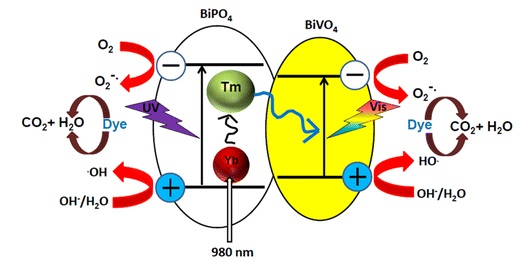
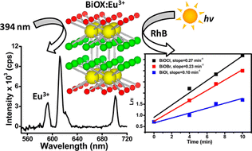
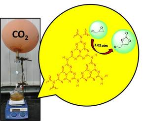
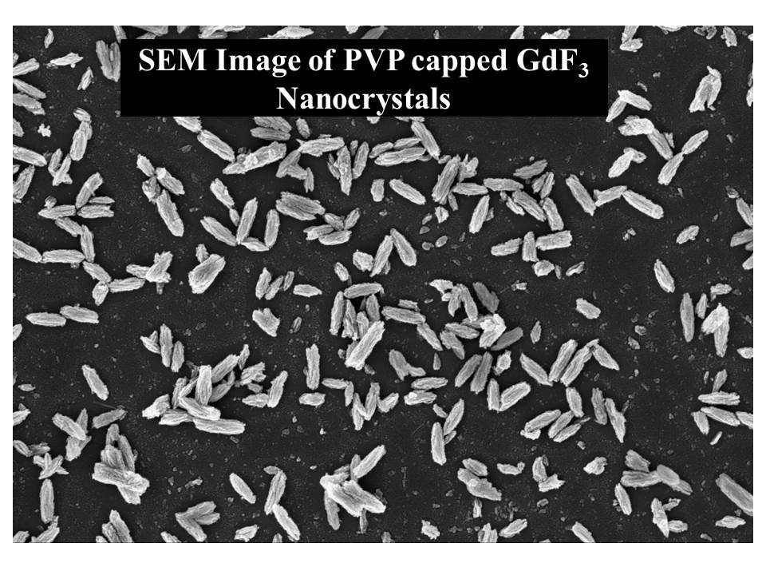
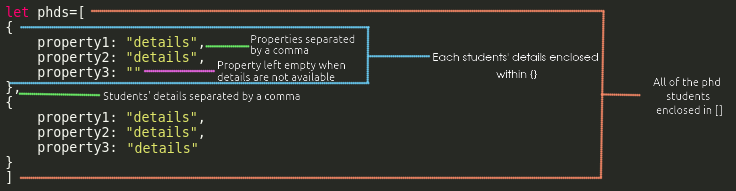

# Maintenance Documentation for www.iiserkol.ac.in/mvenkat

This is a website maintenance documentation for www.iiserkol.ac.in/mvenkat. This file is available in PDF and MD format in the home directory of the website. [Click here for the PDF version](./README.pdf) and [click here for the MD/HTML version](./README.html)

## Contents

1. Web Technologies ........................................................................................................................... **3-7**
    1.1 HTML ............................................................................................................................... **3-4**
    1.2 PHP .................................................................................................................................. **4-5**
    1.3 CSS ................................................................................................................................... **5**
    1.4 JS, JQuery, JSON & AJAX ............................................................................................. **5-7**
    1.5 Markdown ...................................................................................................................... **7**
    1.6 Other Libraries ............................................................................................................... **7**

2. Directory Structure .......................................................................................................................... **7-8**

3. Markdown Tutorial ........................................................................................................................ **8-18**
    3.1 Headers ........................................................................................................................... **9-10**
    3.2 Emphasis ......................................................................................................................... **10-11**
    3.3 Lists .................................................................................................................................. **11-12**
    3.4 Links ................................................................................................................................. **12-13**
    3.5 Images ............................................................................................................................. **13**
    3.6 Code and Syntax Highlighting .................................................................................... **13-14**
    3.7 Tables .............................................................................................................................. **14-15**
    3.8 Blockquotes .................................................................................................................... **15-16**
    3.9 Inline HTML .................................................................................................................... **16**
    3.10 Horizontal Rule ............................................................................................................ **16-17**
    3.11 Line Breaks ................................................................................................................... **17**
    3.12 Youtube videos ............................................................................................................ **17-18**

4. Page Editing .............................................................................................................................. **18-34**
    4.1 Home Page ..................................................................................................................... **18-20**
    &emsp;4.1.1 Editing the slideshow ........................................................................................ **19**
    &emsp;4.1.2 Editing the research and advertisements sections ...................................... **19-20**
    4.2 Research Page ................................................................................................................. **20-21**
    4.3 Publications Page ........................................................................................................... **21-22**
    4.4 Group Page ..................................................................................................................... **22-30**
    &emsp;4.4.1 Supervisor .......................................................................................................... **23-24**
    &emsp;4.4.2 Students ............................................................................................................. **24-30**
    &emsp;&emsp;4.4.2.1 Post Docs ........................................................................................... **24-25**
    &emsp;&emsp;4.4.2.2 PhDs (Properties are same as IPhDs) ............................................ **25-26**
    &emsp;&emsp;4.4.2.3 IPhDs (Properties are same as PhDs) ............................................ **26-27**
    &emsp;&emsp;4.4.2.4 Project Students ............................................................................... **27-28**
    &emsp;&emsp;4.4.2.5 Visitors ............................................................................................... **28-29**
    &emsp;&emsp;4.4.2.6 Alumni ............................................................................................... **29-30**
    4.5 Gallery Page ..................................................................................................................... **30-32**
    4.6 Collaborators Page ......................................................................................................... **32-33**
    4.7 Contact Page .................................................................................................................... **33-34**
5. Appendix: Markdown Cheatsheet ....................................................................................... **35-36**

<br><br><br><br><br><br><br><br><br><br><br><br><br>
<br><br><br><br><br><br><br><br><br><br><br><br><br>


## 1. Web Technologies

---------------
**NOTE**: This website has been built with the assumption that the end user who will be maintaining this website has negligible knowledge about web development, and thus this section might be skipped over. This section rather serves to warn the potential user of the possible failures that can occur due to unnecessary tampering.


---------------
This website is built on, and supports the following web technologies:

1. HTML (HyperText Markup Language version 5)
2. CSS (Cascading stylesheets version 3)
3. JS (Javascript version ECMAScript 6)
4. JQuery (version 3.3.1)
5. PHP (Hypertext preprocessor version 7.2.10)
6. MD (Markdown flavour basic 1.1.3+)
7. JSON (JavaScript Object Notation)
8. AJAX (Asynchronous Javascript and XML)

All of these web technologies are the most major ones used. Any changes to the website would require some knowledge of these depending on the specific portion of the website to be changed. This documentation will attempt to explain which specific technology is used where. This would attempt to give an overview to prevent unnecessary tampering with the source code where it is not required and does not presume to go into depth about how each of these technologies are used.

Other than these major technologies, smaller libraries are also used for achieving specific tasks. Those are also listed afterwards, along with the specific effect they are used to achieve.

### 1.1 HTML

HTML is the basic language of the web and is necessary to build any website. This website however only includes one html based file:

```html
index.php
```

This file looks somewhat like this:-

```html
.
.
.

    </div>
</article>
<!------------------------------------------------ Research Page ----------------------------------------------------------------->
<article class="page research">
    <div class="top r-top">
        <h1><span class="raled">RESEARCH</span></h1>
    </div>
    <div class="r-mid source">
    </div>
    <div class="foot">
        <div>
            <span class="raled">Nano Materials Research Lab</span>
            <br>
            <span class="monster">IISER Kolkata</span>
        </div>
        <div class="iiserk monster"><a href="https://www.iiserkol.ac.in" target="_blank"></a></div>
    </div>
</article>
<!------------------------------------------- Publications Page --------------------------------------------------------------->
<article class="page publications">
.
.
.
```

As evident, this file is just used to define an underlying structure for the whole website and does not contain any content whatsoever (except in a few cases which presumably can be ignored). This is is more of a skeleton of the website rather than the actutal website. Any changes made here will most probably not be reflected in the actual website. However **this file is the backbone of the entire website and any tampering with this file, renaming, or deleting this file might cause the entire website to crash.** It is suggested to practice extreme caution if it is imperative to edit this file, and not attempt any changes without proper knowledge of HTML, JavaScript, and PHP.

### 1.2 PHP

PHP is the language of the backend and does server side processing for the website. PHP is often used alongside html and thus causing the file name extension of HTML files to be changed from .html to .php, as is the case with this website.

1. The html file `index.php` contains a small snippet of PHP code in the beginning which helps generate the "Gallery" page dynamically. It looks like this:

    ```php
    <?php
    require_once('scripts/gallery.php')
    ?>
    ```
    **Add or change anything within the `<?php ?>` at your own risk only if you have an idea of what you are doing.**

2. The scripts directory contains two PHP scripts:<br>
    1. `gallery.php` - Used to dynamically populate the gallery page.
    2. `mail.php` - Used to send query emails from the contact us page to the provided email id.

    **Both of these scripts have a very specific purpose and it is suggested to edit only what is necessary. Erroneous editing of these files might cause the gallery to stop displaying images or the mails to not get routed properly to the designated reciever**

    Only scenario for editing these scripts is when the email address where the queries are to be sent needs to be changed. The exact steps on how to achieve that will be explaned in later sections.

### 1.3 CSS

CSS is the designing language of the web. How the entire website looks is achieved by implementing CSS (v3+). There are two CSS files in the `css` directory:<br>

1. `jquery-gallery.css` - This is the stylesheet for the slideshows present on the website (on the home page and the gallery page). **Changing anything here will not cause the website to crash. *However this can change how the slideshows look, and the user is advised to not tamper with anything here to avoid unnecessary, unexpected or unwanted changes in the design of the slideshows.*** ([This is a publicly available library](https://github.com/smohadjer/jquery.slideshow.git))
2. `main.css` - As evident from the name, this file contains all the style rules for this website, and **has over a thousand lines of code**. Again **changing this file will only change how the website looks, but sometimes very small changes can be catastrophic and thus the user is advised not to tamper with this file much**. Only scenario for editing this file would be to change the color scheme for the website, which is explained in later sections.

### 1.4 JS, JQuery, JSON & AJAX

JS and Jquery+AJAX are used together for scripting this website and most of the heavy lifting is done by these, like:
-  Causing the menu to work
-  Making the content of the website publishable in markdown format
-  Making scrolling animations
-  Making the slideshows
-  Making all the pages to be able to be loaded dynamically without refreshing the page, giving a seamless user experience
- Submitting the query form without ever having to refresh the page (Using AJAX)

All of the JS files used for these purposes are stored in the `js` directory. The files are:<br>

1. `jquery-gallery.js` - Used for making slideshows from a list of images ([This is a publicly available library](https://github.com/smohadjer/jquery.slideshow.git))
2. `markdown.js` - Used for parsing Markdown into html code. This is what enables the user to write code in simple markdown, while it converts it into browser compatible, valid html.([This is a publicly available library](https://github.com/evilstreak/markdown-js))
3. `main.js` - Used to do rest of the work mentioned above. The scope of this script is too vast to explain, but the user would do well to understand that **any tampering with this file can be catastrophic.** An overview of all the function of this script:<br>
    1. Choose which page to go to when a certain menu item is clicked
    2. In mobile view, display the menu when the hamburger icon is clicked
    3. Change the menu positioning to be a bit more non intrusive when the page is scrolled
    4. Remove the preloader (the bubbling beaker) when the page has loaded **(Note that on load, actually only the home page and contact us page are loaded. The other pages are loaded only when they are accessed from the menu to reduce load times)**
    5. Populating the home page with content from the markdown files, making the slideshow on the homepage
    6. Populating the contact us page with contact details provided in the markdown files
    7. Submitting the query form through an asynchronous request to prevent refreshing the page, for a seamless user experience
    8. Loading specific pages when their corresponding menu buttons are clicked byparsing the markdown files and storing them in strings, and only putting them into the pages when requested

JSON, on the other hand, is used for storing the content of this website, along with JS. Most of the content is however written in Markdown format and the JS or JSON file types are primarily for ease of access throush JS. ***These are perhaps the only files in the whole website structure which are supposed to be edited*** **(However caution still needs to be excercised when editing)** All of the JS and JSON files used for storing the content are present in the `txt` directory, and one file present in the `gallery` directory:<br>
1. Inside `txt` :
    1. `group.js` - Contains the details of all the members of the group, mostly in JSON format. *More details on this are available later.*
    2. `text.js` - Contains all of the content to be loaded into the website, mostly in MARKDOWN format. *More details on this are available later.*
2. Inside `gallery`:
    1. `a.json` - Contains an array of 1s and 0s, `1` indicating which section needs to be a slideshow inside the gallery, `0` indicating which section needs to be a grid. *More details on this are available later.*

### 1.5 Markdown

Markdown is a very simple markup language, primarily used for generating web pages with very little coding skills. **It has a much gentler learning curve than HTML (used for web documents), and is much less resource intensive than LATEX (used for print documents), which are two of the most popular markup languages in use today**, which is why  Markdown was chosen as the language for this website. Resources for learning markdown are abundant on the web (An especially great tutorial series is available [here](https://www.markdowntutorial.com/)), I however will provide a reproduction of the documentation of Github Flavoured Markdown available at [markdown-here's repository](https://github.com/adam-p/markdown-here/wiki/Markdown-Cheatsheet) later in this documentation. A pdf version of Github's official Markdown cheatsheet is also provided [here](a). (This documentation is infact also written in Markdown and the markdown format is available [here](a))

The only file that uses markdown in the entire website is the `text.js` file inside the `txt` directory. It is a JS file that stores the content of the website in markdown format.

### 1.6 Other libraries

Other libraries which are also used in the website:
- **Google fonts API** - Used to serve the three different fonts used in the website: `Montserrat`, `Raleway` & `Source Sans Pro`
- **Fontawesome** - Used for generating the various icons used in the website like the `facebook icon`, the `hamburger icon` and the `close button icon`
- **JQuery** - CDN used to enable jquery for the website

<br>
## 2. Directory Structure

The directory structure of the website is as follows:

- css
    - jquery-gallery.css
    - main.css
- gallery
    - 1 A Glimpse of Our Lab
        - (corresponding image files)
    - 2 Microscopic and Optical Images
        - (corresponding image files)
    - 3 Lab Fun
        - (corresponding image files)
    - 4 Lab Visitors
        - (corresponding image files)
    - a.json
- img
    - (all of the relevant images except for the gallery)
- js
    - gallery.json
    - jquery-gallery.js
    - main.js
    - markdown.js
- scripts
    - gallery.php
    - mail.php
- txt
    - group.js
    - text.js
- .gitignore
- index.html
- index.php
- markdown-cheatsheet.pdf
- README.md
- README.pdf

<br>
## 3. Markdown Tutorial
This is intended as a quick reference and showcase. For more complete info, see [John Gruber's original spec](http://daringfireball.net/projects/markdown/) and the [Github-flavored Markdown info page](http://github.github.com/github-flavored-markdown/).

--------------------------
**NOTE**: This tutorial is reproduced from https://github.com/adam-p/markdown-here/wiki/Markdown-Cheatsheet. Credits go to the respective authors.

------------------------


---------------------------
**The most important sections, pertaining to this specific website, in this tutorial are the first six sections. The rest of the sections are not required that much for this website**

------------------------------
##### Table of Contents
[Headers](#headers)<br>
[Emphasis](#emphasis)<br>
[Lists](#lists)<br>
[Links](#links)<br>
[Images](#images)<br>
[Code and Syntax Highlighting](#code)<br>
[Tables](#tables)<br>
[Blockquotes](#blockquotes)<br>
[Inline HTML](#html)
[Horizontal Rule](#hr)<br>
[Line Breaks](#lines)<br>
[YouTube Videos](#videos)<br>

<a name="headers"/>

### 3.1 Headers

```no-highlight
# H1
## H2
### H3
#### H4
##### H5
###### H6

Alternatively, for H1 and H2, an underline-ish style:

Alt-H1
======

Alt-H2
------
```

# H1
## H2
### H3
#### H4
##### H5
###### H6

Alternatively, for H1 and H2, an underline-ish style:

Alt-H1
======

Alt-H2
------

<a name="emphasis"/>

### 3.2 Emphasis

```no-highlight
Emphasis, aka italics, with *asterisks* or _underscores_.

Strong emphasis, aka bold, with **asterisks** or __underscores__.

Combined emphasis with **asterisks and _underscores_**.

Strikethrough uses two tildes. ~~Scratch this.~~
```

Emphasis, aka italics, with *asterisks* or _underscores_.

Strong emphasis, aka bold, with **asterisks** or __underscores__.

Combined emphasis with **asterisks and _underscores_**.

Strikethrough uses two tildes. ~~Scratch this.~~


<a name="lists"/>

### 3.3 Lists

(In this example, leading and trailing spaces are shown with with dots: ⋅)

```no-highlight
1. First ordered list item
2. Another item
⋅⋅* Unordered sub-list.
1. Actual numbers don't matter, just that it's a number
⋅⋅1. Ordered sub-list
4. And another item.

⋅⋅⋅You can have properly indented paragraphs within list items. Notice the blank line above, and the leading spaces (at least one, but we'll use three here to also align the raw Markdown).

⋅⋅⋅To have a line break without a paragraph, you will need to use two trailing spaces.⋅⋅
⋅⋅⋅Note that this line is separate, but within the same paragraph.⋅⋅
⋅⋅⋅(This is contrary to the typical GFM line break behaviour, where trailing spaces are not required.)

* Unordered list can use asterisks
- Or minuses
+ Or pluses
```

1. First ordered list item
2. Another item
  * Unordered sub-list.
1. Actual numbers don't matter, just that it's a number
  1. Ordered sub-list
4. And another item.

   You can have properly indented paragraphs within list items. Notice the blank line above, and the leading spaces (at least one, but we'll use three here to also align the raw Markdown).

   To have a line break without a paragraph, you will need to use two trailing spaces.
   Note that this line is separate, but within the same paragraph.
   (This is contrary to the typical GFM line break behaviour, where trailing spaces are not required.)

* Unordered list can use asterisks
- Or minuses
+ Or pluses

<a name="links"/>

### 3.4 Links

There are two ways to create links.

```no-highlight
[I'm an inline-style link](https://www.google.com)

[I'm an inline-style link with title](https://www.google.com "Google's Homepage")

[I'm a reference-style link][Arbitrary case-insensitive reference text]

[I'm a relative reference to a repository file](../blob/master/LICENSE)

[You can use numbers for reference-style link definitions][1]

Or leave it empty and use the [link text itself].

URLs and URLs in angle brackets will automatically get turned into links.
http://www.example.com or <http://www.example.com> and sometimes
example.com (but not on Github, for example).

Some text to show that the reference links can follow later.

[arbitrary case-insensitive reference text]: https://www.mozilla.org
[1]: http://slashdot.org
[link text itself]: http://www.reddit.com
```

[I'm an inline-style link](https://www.google.com)

[I'm an inline-style link with title](https://www.google.com "Google's Homepage")

[I'm a reference-style link][Arbitrary case-insensitive reference text]

[I'm a relative reference to a repository file](../blob/master/LICENSE)

[You can use numbers for reference-style link definitions][1]

Or leave it empty and use the [link text itself].

URLs and URLs in angle brackets will automatically get turned into links.
http://www.example.com or <http://www.example.com> and sometimes
example.com (but not on Github, for example).

Some text to show that the reference links can follow later.

[arbitrary case-insensitive reference text]: https://www.mozilla.org
[1]: http://slashdot.org
[link text itself]: http://www.reddit.com

<a name="images"/>

### 3.5 Images

```no-highlight
Here's our logo (hover to see the title text):

Inline-style:


Reference-style:
![alt text][logo]

[logo]: https://github.com/adam-p/markdown-here/raw/master/src/common/images/icon48.png "Logo Title Text 2"
```

Here's our logo (hover to see the title text):

Inline-style:


Reference-style:
![alt text][logo]

[logo]: https://github.com/adam-p/markdown-here/raw/master/src/common/images/icon48.png "Logo Title Text 2"

<a name="code"/>

### 3.6 Code and Syntax Highlighting

Code blocks are part of the Markdown spec, but syntax highlighting isn't. However, many renderers -- like Github's and *Markdown Here* -- support syntax highlighting. Which languages are supported and how those language names should be written will vary from renderer to renderer. *Markdown Here* supports highlighting for dozens of languages (and not-really-languages, like diffs and HTTP headers); to see the complete list, and how to write the language names, see the [highlight.js demo page](http://softwaremaniacs.org/media/soft/highlight/test.html).

```no-highlight
Inline `code` has `back-ticks around` it.
```

Inline `code` has `back-ticks around` it.

Blocks of code are either fenced by lines with three back-ticks <code>```</code>, or are indented with four spaces. I recommend only using the fenced code blocks -- they're easier and only they support syntax highlighting.

<pre lang="no-highlight"><code>```javascript
var s = "JavaScript syntax highlighting";
alert(s);
```

```python
s = "Python syntax highlighting"
print s
```

```
No language indicated, so no syntax highlighting.
But let's throw in a &lt;b&gt;tag&lt;/b&gt;.
```
</code></pre>


```javascript
var s = "JavaScript syntax highlighting";
alert(s);
```

```python
s = "Python syntax highlighting"
print s
```

```
No language indicated, so no syntax highlighting in Markdown Here (varies on Github).
But let's throw in a <b>tag</b>.
```


<a name="tables"/>

### 3.7 Tables

Tables aren't part of the core Markdown spec, but they are part of GFM and *Markdown Here* supports them. They are an easy way of adding tables to your email -- a task that would otherwise require copy-pasting from another application.

```no-highlight
Colons can be used to align columns.

| Tables        | Are           | Cool  |
| ------------- |:-------------:| -----:|
| col 3 is      | right-aligned | $1600 |
| col 2 is      | centered      |   $12 |
| zebra stripes | are neat      |    $1 |

There must be at least 3 dashes separating each header cell.
The outer pipes (|) are optional, and you don't need to make the
raw Markdown line up prettily. You can also use inline Markdown.

Markdown | Less | Pretty
--- | --- | ---
*Still* | `renders` | **nicely**
1 | 2 | 3
```

Colons can be used to align columns.

| Tables        | Are           | Cool |
| ------------- |:-------------:| -----:|
| col 3 is      | right-aligned | $1600 |
| col 2 is      | centered      |   $12 |
| zebra stripes | are neat      |    $1 |

There must be at least 3 dashes separating each header cell. The outer pipes (|) are optional, and you don't need to make the raw Markdown line up prettily. You can also use inline Markdown.

Markdown | Less | Pretty
--- | --- | ---
*Still* | `renders` | **nicely**
1 | 2 | 3

<a name="blockquotes"/>

### 3.8 Blockquotes

```no-highlight
> Blockquotes are very handy in email to emulate reply text.
> This line is part of the same quote.

Quote break.

> This is a very long line that will still be quoted properly when it wraps. Oh boy let's keep writing to make sure this is long enough to actually wrap for everyone. Oh, you can *put* **Markdown** into a blockquote.
```

> Blockquotes are very handy in email to emulate reply text.
> This line is part of the same quote.

Quote break.

> This is a very long line that will still be quoted properly when it wraps. Oh boy let's keep writing to make sure this is long enough to actually wrap for everyone. Oh, you can *put* **Markdown** into a blockquote.

<a name="html"/>

### 3.9 Inline HTML

You can also use raw HTML in your Markdown, and it'll mostly work pretty well.

```no-highlight
<dl>
  <dt>Definition list</dt>
  <dd>Is something people use sometimes.</dd>

  <dt>Markdown in HTML</dt>
  <dd>Does *not* work **very** well. Use HTML <em>tags</em>.</dd>
</dl>
```

<dl>
  <dt>Definition list</dt>
  <dd>Is something people use sometimes.</dd>

  <dt>Markdown in HTML</dt>
  <dd>Does *not* work **very** well. Use HTML <em>tags</em>.</dd>
</dl>

<a name="hr"/>

### 3.10 Horizontal Rule

```
Three or more...

---

Hyphens

***

Asterisks

___

Underscores
```

Three or more...

---

Hyphens

***

Asterisks

___

Underscores

<a name="lines"/>

### 3.11 Line Breaks

My basic recommendation for learning how line breaks work is to experiment and discover -- hit &lt;Enter&gt; once (i.e., insert one newline), then hit it twice (i.e., insert two newlines), see what happens. You'll soon learn to get what you want. "Markdown Toggle" is your friend.

Here are some things to try out:

```
Here's a line for us to start with.

This line is separated from the one above by two newlines, so it will be a *separate paragraph*.

This line is also a separate paragraph, but...
This line is only separated by a single newline, so it's a separate line in the *same paragraph*.
```

Here's a line for us to start with.

This line is separated from the one above by two newlines, so it will be a *separate paragraph*.

This line is also begins a separate paragraph, but...
This line is only separated by a single newline, so it's a separate line in the *same paragraph*.


<a name="videos"/>

### 3.12 YouTube Videos

They can't be added directly but you can add an image with a link to the video like this:

```no-highlight
<a href="http://www.youtube.com/watch?feature=player_embedded&v=YOUTUBE_VIDEO_ID_HERE
" target="_blank"></a>
```

Or, in pure Markdown, but losing the image sizing and border:

```no-highlight
[](http://www.youtube.com/watch?v=YOUTUBE_VIDEO_ID_HERE)
```

Referencing a bug by #bugID in your git commit links it to the slip. For example #1.

---

<br>

## 4. Page Editing

This section seeks to explain how to edit each of the pages in the website and will mainly concern itself with the three files `group.js` and `text.js` present in the `txt` directory and `a.json` present in the `gallery` directory. This will assume that the reader has a sufficient knowledge of Markdown. **Please make sure you are familiar with the directory structure, so that it is easier for you to understand which files are being edited when**

-------------------
**If you are not familiar with markdown, go back to the previous section where a tutorial for Markdown is provided. If you don't remember some basics, read the cheatsheet provided with this documentation.**

------------------

------------------
**CAUTION:** All of the website content is stored in markdown format inside variables. Changing the variable names will cause the website to break

------------------------

### 4.1 Home Page

The Home Page contains three sections primarily: the research interests, the advertisements and the slideshow. To make any changes to these, you need to open `text.js` present inside the directory `txt`.

#### 4.1.1 Editing the slideshow
Inside text.js, in the beginning you will find a variable `image_list`:<br>

```javascript
//Slideshow images
let image_list=["1818948_orig.jpg","8530811_orig.jpg","9206974_orig.jpg"]
```
This line is what makes the slideshow. To add a new image, upload an image to the directory `img`, and then add the name of the image file inside the `[]` brackets with `""` quotation marks around the name of the image and a `,` comma separating each image's name. The order of the image names within this list is the exact order in which the images will appear in the slideshow. So, **for example**, if I want to add a new image called `new.png` as the third slide in the slideshow, as well as remove the current second slide, I would need to upload `new.png` to the img folder, then add `new.png` to the list, so the list would look like this:

```javascript
["1818948_orig.jpg","9206974_orig.jpg","new.png"]
```

Adding another image `new2.gif` as the first image would make the list like this *(The image needs to be uploaded first)*:

```javascript
["new2.gif","1818948_orig.jpg","9206974_orig.jpg","new.png"]
```

Thus the basic steps for editing the slideshow are:

1. Upload the image you want to the directory `img`
2. Open `txt/text.js` and edit the line containing `image_list` and add the image filename at whichever position you want inside the list *(Everything inside the `[]` square brackets is inside the list)*

#### 4.1.2 Editing the research and advertisements sections

These two sections are written in pure markdown and will support any valid markdown. These two sections are also edited from the `text.js` file

1. To edit the research interests section:

    There is a variable called `research_interests` in the `text.js` file. This variable stores the research interests section and looks like this:
    ```javascript
    let research_interests=`
    **Our group's research interests encompass the following topics:**

    - Synthesis of Ln3+ ion doped nanocrystals and their utilization in sensing, phosphors and NIR active photocatalytic materials
    - Synthesis of metal free polymeric materials for CO2 utilization
    - Porous materials for metal ion and toxicant removal from water bodies
    - Electrochemical and Photoelectrochemical water splitting
    `
    ```
    As you can see, the first line is **bold** and the next few lines are bullets *(If you did not know this, please visit the previous section which explains how to use markdown)*. Any other valid markdown can also be used.
    **Everything needs to be within the enclosing  ` `` ` (backticks) however**

2. To edit the advertisements section:

    There is a variable called `advertisements` inside `text.js`. This variable stores the advertisements section and looks like this:
    ```javascript
    let advertisements=`
    ## Advertisements

    - Currently there is no research position available in the group. However, interested candidates with personal funding can directly mail Dr. Venkataramanan Mahalingam.

    `
    ```
    As you can see, the first line is a 2nd level header, and the next line is a bullet. *(If you did not know this, please visit the previous section which explains how to use markdown)*. Any other valid markdown can also be used.
    **Everything needs to be within the enclosing  ` `` ` (backticks) however**

### 4.2 Research Page

The research page is written completely in Markdown and is very easy to edit with basic knowledge of markdown.

Inside the `text.js` file, there is a variable called `research _content` which holds the content for the research page and it looks like this:

```javaScript
let research_content=`
1. We investigate structural and optical characteristics of lanthanide-doped luminescence nanomaterials, such as oxides, fluorides, oxyfluorides, sulfates, etc. We use a wide range of synthetic methods like sol-gel, thermal decomposition, microwave and hydrothermal to make these nanomaterials. We utilize the developed materials for various applications, such as metal ion and molecular sensing, bioimaging, etc.



2. We are working towards developing functional nanocomposites by integrating ultrasmall nanomaterials such as Ln- doped nanocrystals, carbon dots etc. with metal nanoparticles and polymers. Consequently, we study their structural optical and energy transfer properties.
3. Synthesis of low- cost nanomaterials for energy storage (supercapacitor, electrocatalysts) and photovoltaic application.
4. We are working on CO2 fixation for the production of value-added chemicals under ambient condition using metal-free polymeric catalyst (e.g., ionic liquids, g-C3N4). To achieve the goal, we are trying to efficiently convert epoxide to cyclic carbonate under ambient CO2 pressure (1.02 atm). Cyclic carbonates are interesting as highly polar aprotic solvent, solvent for lithium ion battery, monomer for polycarbonate etc. Moreover, di-cyclic carbonates could be useful for the preparation of polyurethanes. This could be a potential by-pass of isocyanates for the preparation of polyurethanes.


`
```

As you can see, the text above contains a numbered list as well as images.  *(If you did not know this, please visit the previous section which explains how to use markdown)*. Any other valid markdown can also be used.
**Everything needs to be within the enclosing  ` `` ` (backticks) however**

### 4.3 Publications Page

The publications page is also written in pure markdown, but you need to follow a specific format to edit the page correctly. All markdown is **not** valid.

There is a variable called `publication_list` inside text.js. This variable contains all the content of the publications page in markdown format. However a strict format needs to be followed.

The `publication_list` variable looks like this:

```javascript
let publication_list=`

# FULL PUBLICATION LIST (according to date of acceptance)
## 2018
- 70. Rectification and amplification of ionic current in planar graphene/graphene-oxide junctions: An electrochemical diode and transistor. S. K. Jana, S. Banerjee, S. Bayan, H. R. Inta and V. Mahalingam*, J. Phys. Chem. C, 2018, 122, 21, 11378-11384.
- 69. Host sensitized intense infrared emissions from Ln3+ doped GdVO4 nanocrystas: Ranging from 950 nm to 2000 nm. T. Samanta, A. E. Praveen and V. Mahalingam*, J. Mater. Chem. C, 2018, 6, 4878-4886.

## 2017
- 68. Ce3+-sensitized Tm3+/Mn2+-doped NaYF4 colloidal nanocrystals: Intense cool white light from a photophor-coated UV LED. V. N. K. B. Adusumalli, H. V. S. R. M. Koppisetti and V. Mahalingam*, Chem. Eur. J., 2017, 23, 18134–18139.
- 67. CO2 Fixation: g-C3N4 and tetrabutylammonium bromide catalyzed efficient conversion of epoxide under ambient condition. T. Biswas and V. Mahalingam*, New J. Chem., 2017, 41, 14839-14842.
- 66. Strong  UV Emission from Colloidal Eu2+‐Doped BaSO4 Nanoparticles: A Material for Enhancing the Photocatalytic Activity of Carbon Dots. C. Hazra, T. Samanta, S. Ganguli and V. Mahalingam, Chem. Select, 2017, 2, 5970-5977.
​- 65. Ligand sensitized strong luminescence from Eu3+ -doped LiYF4 nanocrystals: a photon down-shifting strategy to increase solar- to- current conversion efficiency. T. Samanta, S. K. Jana, A. E. Praveen and V. Mahalingam*, Dalton Trans., 2017, 46, 9646-9653.
- 64. Tuning the Energy Transfer Efficiency between Ce3+ and Ln3+ Ions (Ln=Tm, Sm, Tb, Dy) by Controlling the Crystal Phase of NaYF4 Nanocrystals. V. N. K. B. Adusumalli, H. V. S. R. M. Koppisetti, S. Ganguli, S. Sarkar and V. Mahalingam*, Chem. Eur. J., 2017, 23, 994–1000.

## 2016
- 63. Host-Guest and Electrostatic Interaction in Supramolecular Nanoparticles Clusters. L. Graña‐Suárez, W. Verboom, R. J. M. Egberink, S. Sarkar, V. Mahalingam and J. Huskens*, Eur. J. Org. Chem., 2016, 33, 5511–5518.
- 62. Selective Detection of H2O2 Using para-Phenylenediamine Capped Ce3+/Tb3+-Doped NaYF4 Microrods. B. Meesaragandla, A. Verma, V. Bheemireddy and V. Mahalingam*, Chem. Select, 2016, 1 (15), 4927-4934.
- 61. A greener approach towards making highly luminescent Ln3+ -doped NaYF4 nanoparticles with ligand-assisted phase control. D. Sarkar, B. Meesaragandla, T. Samanta and V. Mahalingam*, Chem. Select, 2016, 1 (15), 4785-4793.
.
.
.
`

```

All of the content is enclosed within the ` `` ` backticks. The first line displays an image at the beginning of the page. The second line us used for the heading "FULL PUBLICATION LIST (according to date of acceptance)". These two lines are in markdown format and can be edited in any way you want. Any other valid markdown can also be inserted here.

From the next line starts the publication list. The publication list is also in markdown format, but **a specific format needs to be followed for the page to be displayed correctly**. The format is as follows:

1. The publication year needs to be preceded by two `##` pound signs, followed by a space. i.e. like this: `## year`.
2. The publication list must start from the next line.
3. The publication list is in bullet point format. i.e. The line must start with a `-` hyphen, followed by a space, then the publication number, and then the publication details, like this: `- <publication number>. <publication details>` .
4. Each new publication must start from a new line.
5. There needs to be an empty line between the publication lists of any two years.
6. Everything needs to be within the enclosing  ` `` ` (backticks).

### 4.4 Group Page

The group page is perhaps the most complicated page to edt in the entire website. This page is not written in markdown format, but rather uses a JSON format due to the JSON format's easy characterization features. The group page is thus present in a separate file called `group.js` inside the `txt` directory.

To edit the group page, open `txt/group.js`. The file looks like this:

```javascript
let head_card={
    title: "Group Supervisor",
    name: "Dr. Venkatramanan Mahalingam",
    photo: "1453113520.png",
    positions: ["Associate Professor (2014-present)","Assistant Professor (2009-2013)","Department of Chemical Sciences,Indian Institute of Science Education and Research Kolkata (IISER K) Mohanpur Campus, Nadia, 741252, West Bengal, India","Editorial Board Member, Scientific Reports"],
    email: ["mvenkataramanan@yahoo.com","mvenkat@iiserkol.ac.in"],
    qualifications: ["B. Sc.,Chemistry, American College, Madurai, (1994)","M. Sc., Chemistry, American College, Madurai, (1996)","PhD, Chemistry, under Prof. T. Pradeep, Indian Institute of Technology, Madras (IIT-M), (2001)","Post doctoral scholar, under Prof. D. N. Reinhoudt, University of Twente, Netherlands (Oct 2001-Oct 2003)","Post doctoral Fellow, under Prof. FCJM van Veggel, University of Victoria, Canada (April 2004-April 2007)","Post doctoral Associate, under Prof. John. A. Capobianco, Concordia University, Canada (May 2007- April, 2009)","Visiting Faculty, University of Denver, Colorado, USA  (July -August 2012)"]
}

let postdocs=[
{
    name: "Dr. Sourav Ghosh",
    position: "Post-doc Fellow (NPDF), IISER Kolkata",
    duration: "(Aug, 2017)-present",
    topic: "Fabrication of porous transition metal oxide nano-structure for next generation sodium ion batteries and super-capacitors",
    profile: "Ph.D., CGCRI",
    email: "sourav.g1989@gmail.com",
    photo: "sourav-ghosh.jpg"
},
{
    name: "Dr. Mohua Chakraborty",
    position: "Post-doc Fellow (NPDF), IISER Kolkata",
.
.
.

```

The file is divided into different sections depending on the type of the members of the group. Adding new members or editing them is very similar for all of them with very minute differences here and there. Each type of member has specific details, which are stored in object (JSON) format. The format is pretty much as follows:

```javascript
{
    property: "details",
    property: "details",
    .
    .
    .
}
```

However editing each of the different sections will be explained here one by one.

#### 4.4.1 Supervisor

The supervisor's details are stored inside the variable called `head_card`. **All of the details are enclosed within `{}` curly brackets** and any change must be made inside the curly brackets. Inside the curly brackets there are a number of properties, followed by their details. **Do not edit the property name. Only the property details are to be edited**. **New properties cannot be added**. The available properties are:

1. **title** - to edit the title just change anything inside the `""` double quotes.
2. **name** - to edit the name (e.g. to change Dr. to Prof.) just change anything inside the `""` double quotes.
3. **photo** - to change the displyed picture, upload a new photo to the `img` directory and put the name of the file inside the `""` double quotes.
4. **positions** - the positions are given in a list format. i.e enclosed by `[]` square brackets. All of the positions are present inside the `[]` square brackets, and each position is enclosed within `""` double quotes, with each position separated by a `,` comma. To add a new posititon, put it inside the `[]` square brackets, enclosed by `""` double quotes, and separated from the others by a `,` comma.
5. **email** - the emails are given in a list format. i.e enclosed by `[]` square brackets. All of the emails are present inside the `[]` square brackets, and each email is enclosed within `""` double quotes, with each email separated by a `,` comma. To add a new email, put it inside the `[]` square brackets, enclosed by `""` double quotes, and separated from the others by a `,` comma.
6. **qualifications** - the qualifications are given in a list format. i.e enclosed by `[]` square brackets. All of the qualifications are present inside the `[]` square brackets, and each qualification is enclosed within `""` double quotes, with each qualification separated by a `,` comma. To add a new qualification, put it inside the `[]` square brackets, enclosed by `""` double quotes, and separated from the others by a `,` comma.

#### 4.4.2 Students

The students' details are all present in a list format. i.e. enclosed by `[]` square brackets. Each section (i.e. postdocs, phs, etc.) is a list. Each list contains details of each student in object format, i.e. enclosed within `{}` curly brackets. The students' details are enclosed within `{}` curly brackets, with each student separated from the other by a `,` comma. Within the `{}` curly brackets, each type of student has a few specific properties available to them, which can be edited. A property can be left empty, but it needs to be provided even if the details are not available. The properties need to be separated from each other by a `,` comma. e.g - The PhDs section would look like this:



Each type of students is enclosed within a list and has a fixed number of properties. The properties will be explained one by one in the succeding sections

##### 4.4.2.1 Post Docs

**Available Properties:**
- name
- position
- duration
- topic
- profile
- email
- photo

A list of post docs looks like this:

```javascript
let postdocs=[
{
    name: "Dr. Sourav Ghosh",
    position: "Post-doc Fellow (NPDF), IISER Kolkata",
    duration: "(Aug, 2017)-present",
    topic: "Fabrication of porous transition metal oxide nano-structure for next generation sodium ion batteries and super-capacitors",
    profile: "Ph.D., CGCRI",
    email: "sourav.g1989@gmail.com",
    photo: "sourav-ghosh.jpg"
},
{
    name: "Dr. Mohua Chakraborty",
    position: "Post-doc Fellow (NPDF), IISER Kolkata",
    duration: "(Oct, 2017)-present",
    topic: "Metal oxide thin films for solar cell and photoelectrochemical water splitting applications",
    profile: "Ph.D., IIT (ISM) Dhanbad",
    email: "mchakraborty1988@gmail.com",
    photo: "mahuya.jpg"
}
]
```

- To change any detail, change whatever is inside the `""` double quotes.
- To add a new member, put all of the properties of the student inside `{}` braces **(All of the properties are compulsory, even if they are left empty)**, and put it insisde the enclosing `[]` square brackets, separated from the other students by a comma.
- The photo needs tobe uploaded into the directory `img`, and the filename of the photo needs to be provided

##### 4.4.2.2 PhDs (Properties are same as IPhDs)

**Available Properties:**
- name
- position
- duration
- topic
- profile
- email
- contact
- photo

A list of PhDs looks like this:

```javascript
let phds=[
{
    name: "A.V. N. Kishor Babu",
    position: "SRF (UGC), IISER Kolkata",
    duration: "(Jan, 2013)-present",
    topic: "Lanthanide based luminescent nanomaterials for LED, sensing and bio-applications",
    profile: "M.Sc., Kakatiya University",
    email: "kishor.adusumalli8@gmail.com",
    contact: "07602894385",
    photo: "3258617.jpg"
},
{
    name: "Tanmoy Biswas",
    position: "SRF (UGC), IISER Kolkata",
    duration: "(Feb, 2014)-present",
    topic: "CO2 fixation into useful chemicals and fuel",
    profile: "M.Sc., IIT-Kharagpur",
    email: "biswastanmoy88@gmail.com",
    contact: "08967730971",
    photo: "4199023.jpg"
}
]
```

- To change any detail, change whatever is inside the `""` double quotes.
- To add a new member, put all of the properties of the student inside `{}` braces **(All of the properties are compulsory, even if they are left empty)**, and put it insisde the enclosing `[]` square brackets, separated from the other students by a comma.
- The photo needs tobe uploaded into the directory `img`, and the filename of the photo needs to be provided

##### 4.4.2.3 IPhDs (Properties are same as PhDs)

**Available Properties:**
- name
- position
- duration
- topic
- profile
- email
- contact
- photo

A list of IPhDs looks like this:


```javascript
let iphds=[
{
    name: "Debashrita Sarkar",
    position: "SRF (IISER Fellow), IISER-Kolkata",
    duration: "(Jul, 2015)-present",
    topic: "Caltalytic activation of silicate materials",
    profile: "Integrated MS-Ph.D. student, IISER Kolkata",
    email: "debashrita1chemistry@gmail.com",
    contact: "09563165894",
    photo: "1453204988.png"
},
{
    name: "Khushboo Paliwal",
    position: "2nd year IPhD Project (IISER Fellow), IISER-Kolkata",
    duration: "(May, 2018)-present",
    topic: "CO2 fixation by polymeric materials",
    profile: "Integrated MS-Ph.D. student, IISER Kolkata",
    email: "khushboopaliwal@gmail.com",
    contact: "08788713249",
    photo: "photo.jpg"
}
]
```

- To change any detail, change whatever is inside the `""` double quotes.
- To add a new member, put all of the properties of the student inside `{}` braces **(All of the properties are compulsory, even if they are left empty)**, and put it insisde the enclosing `[]` square brackets, separated from the other students by a comma.
- The photo needs tobe uploaded into the directory `img`, and the filename of the photo needs to be provided


##### 4.4.2.4 Project Students

**Available Properties:**
- name
- position
- topic
- email
- contact
- photo

A list of Project Students looks like this:


```javascript
let projectstudents=[
{
    name: "Rahul Kumar",
    position: "4th year Project, IISER-Kolkata",
    topic: "Ternary metal chalcogenides for electrocatalysis",
    email: "rkrahulkumar063@gmail.com",
    contact: "07063265389",
    photo: "14241476-1087649264651080-2776107237454309044-o.jpeg"
},
{
    name: "Soumik Das",
    position: "4th year Project, IISER-Kolkata",
    topic: "Hydrogen evolution reaction using transition metal compounds",
    email: "soumik.mm@gmail.com",
    contact: "09831499435",
    photo: "9459788.jpg"
}
]
```


- To change any detail, change whatever is inside the `""` double quotes.
- To add a new member, put all of the properties of the student inside `{}` braces **(All of the properties are compulsory, even if they are left empty)**, and put it insisde the enclosing `[]` square brackets, separated from the other students by a comma.
- The photo needs tobe uploaded into the directory `img`, and the filename of the photo needs to be provided


##### 4.4.2.5 Visitors

**Available Properties:**
- name
- current_position
- duration
- topic
- email
- contact
- photo

A list of visitors looks like this:

```javascript
let visiting=[
{
    name: "Dr. Amlan Kumar Pal",
    current_position: "Leverhulme Early Career Fellow",
    duration: "(May 2018-July 2018)",
    topic: "Supramolecular Chemistry and Photophysics",
    email: "akp5@st-andrews.ac.uk",
    contact: "+44-7759495542",
    photo: "importedprofilephoto.jpg"
}
]
```


- To change any detail, change whatever is inside the `""` double quotes.
- To add a new member, put all of the properties of the student inside `{}` braces **(All of the properties are compulsory, even if they are left empty)**, and put it insisde the enclosing `[]` square brackets, separated from the other students by a comma.
- The photo needs tobe uploaded into the directory `img`, and the filename of the photo needs to be provided


##### 4.4.2.6 Alumni

The alumni are unique in the way that they can be classified into PhDs, or IphDs, or Project Students, so each of them will have different properties. So for the list of alumni, all the properties are **not compulsory**. If a property is not availabe, then don't write it, and it won't be displayed. Even if it is left empty, it won't be displayed. The properties `photo` and `name` are however compulsory. Other than that the rest of the things are similar.

**Available Properties:**
- name *[compulsory]*
- position *[optional]*
- current_position *[optional]*
- duration *[optional]*
- topic *[optional]*
- profile *[optional]*
- email *[optional]*
- contact *[optional]*
- photo *[compulsory]*

A list of alumni might look like this **(Notice how each of them have difefrent properties)**:

```javascript
let alumni=[
{
    name: "Nikita Madhukar",
    position: "5th year Project, IISER-Kolkata",
    topic: "Sensing of anions using Ln3+ doped nanocrystals",
    photo: "nikkita.jpg"
},
{
    name: "Aswanth V P",
    position: "5th year Project, IISER-Kolkata",
    topic: "Synthesis of hetero-junction nano-composites for catalysis",
    email: "aswanthpurameri@gmail.com",
    contact: "08170896672",
    photo: "aswanth-2.jpeg"
},
{
    name: "Dr. Tuhin Samanta",
    current_position: "Postdoctoral Fellow, KIT, Germany",
    duration: "(Jan, 2013- March, 2017)",
    topic: "Sensitization of lanthanide ions luminescence and it's applications",
    email: " tuhinchem.164@gmail.com",
    contact: "8927297120",
    photo: "tuhin3.jpeg"
},
{
    name: "Akash Verma",
    position: "",
    current_position: "",
    duration: "",
    topic: "Synthesis of Ln3+ doped NaYF4 Hydrogel Nanocomposites",
    profile: "",
    email: "verma.akash2111@gmail.com",
    contact: "8017482474",
    photo: "4286068.jpg"
}
]
```

- To change any detail, change whatever is inside the `""` double quotes.
- To add a new member, put all of the properties of the student inside `{}` braces **(Properties can be skipped if details are not available, or left empty if details might be made available later)**, and put it insisde the enclosing `[]` square brackets, separated from the other students by a comma.
- The photo needs tobe uploaded into the directory `img`, and the filename of the photo needs to be provided
- New properties cannot be made up. All the properties that can be used are provided in the list at the beginning of this subsection.

### 4.5 Gallery Page

The gallery page is generated dynamically, and not much editing needs to be done to update the gallery. Everythting related to the gallery is present in the directory `gallery` and this section will only deal with that directory.

The gallery page is divided into sections like `A Glimpse of Our Lab` , `Lab Fun` , etc. If you are familiar with the directory structure, you will notice that each of these sections is present as a folder inside the `gallery` directory. The gallery page detects what folders are present inside the `gallery` directory and makes sections out of it, displaying all the photos present inside the folders in the corresponding sections.

**The folders are numbered, and they represent the order in which they appear on the gallery page**
**The name of the folder becomes the heading of the section, after removing the preceding number**

 So `1 A Glimpse of Our Lab` will become the first section on the gallery page and the heading of the section will be `A Glimpse of Our lab`. All the photos inside `1 A Glimpse of Our Lab` will be displayed inside this section.

#### Slideshows

 Any section can be made into a slideshow. To make a section into a slideshow, open `a.json` inside the directory `gallery`. The file looks like this:

 ```javascript
    slideshow='[0,0,0,1]'
 ```
`0` stands for not a slideshow (i.e. a grid of photos) and `1` stands for a slideshow of photos. So this file basically means that the first three sections are not slideshows and the fourth section is a slideshow. To change any other section from a grid to a slideshow, change the number at its corresponding position from `0` to `1`. e.g. - To make the second section into a slideshow, change the second number in a.json from `0` to `1` like: `[0,1,0,1]`


#### To add new images

 To add an image to a section of the gallery, just upload the image into ts corresponding folder. e.g - To add an image to the section `Lab Fun`, upload the image to `3 Lab Fun` and it will automatically appear on the Gallery Page.

#### To remove an image

To remove an image, just delete the image from the folder it is present in, and it wll disappear from the gallery page. e.g. - To remove a photo from the section `Lab Visitors` just delete the photo from `4 Lab Visitors` and it will automatically be removed from the Gallery page

#### To make a new section

To make a new section, just make a new folder inside `gallery`, numbering it according to its position, and put all the images for this section inside this folder. The section will automatically be added to the Gallery page.

**e.g. -** For a new section called `New Section` which will be the third section:
1. Make a folder `3 New Section` inside `gallery`
2. Put all the photos for this section inside this folder
3. Rename the previously third section folder from `3 Lab Fun` to `4 Lab Fun`, the previously fourth section from `4 Lab Visitors` to `5 Lab Visitors` and so on
4. Edit a.json to indicate which section you want to become a slideshow. For instance if this section is not a slideshow, then `a.json` becomes
```javascript
slideshow='[0,0,0,0,1]'
```


### 4.6 Collaborators Page

The collaborators page is also written in pure markdown and the content is stored in `text.js` inside the `txt` directory. However **a specific format needs to be followed** for this page.

Inside `text.js` there is a variable called `collaborators` which stores all the data of the collaborators. It looks like this:

```javascript
let collaborators = `
-   **Name:** Prof. T. Pradeep

    **Position:** Professor

    **Address:** Department of Chemistry, IIT-Madras, Chennai, India.

    **E mail:** pradeep@iitm.ac.in


-   **Name:** Dr. Vivek Polshettiwar

    **Position:** Associate Professor

    **Address:** Department of Chemical Sciences, TIFR-Mumbai, Mumbai, India.

    **E mail:** vivekpol@tifr.res.in

`
```

As you can see, the whole page is made of bullet points bullets *(If you did not know this, please visit the previous section which explains how to use markdown)*. Any other valid markdown can also be used.
**Everything needs to be within the enclosing  ` `` ` (backticks)**

**The following format needs to be followed for the page to be displayed correctly:-**

1. Each new collaborators details should start with a `-` hyphen, followed by **1 space** then the word `Name:` written in bold, i.e. enclosed in two `**` asterisks (i.e `**Name:**`) Then the name of the collaborator.
2. One empty line needs to be left after each detail
3. Each line containing a detail after the first detail (name) must start with a **space**
4. The name of the detail (i.e `Position` or `Address` or `Email`) must be bold, just like the name **(See the Markup Tutorial section if you don't know how to make text bold)**
5. The detail itself (i.e `Associate Professor` or `pradeep@iitm.ac.in`) does not need to be bold
6. There should be a gap of two lines between each collaborators details
7. Again, Everything needs to be within the enclosing  ` `` ` (backticks)

### 4.7 Contact Page

The contact page does not contain too much editable content. Only the email address and the physical address can be changed. Inside `text.js` there is a variable called `email` which contains the email address and a variable called `physicaladdr` which contains the physical address. The physical address is written in markdown format.

The contact section in `text.js` looks lke this:

```javascript


/*---------------------------------- Contact Page -------------------------------*/

let email="mvenkatramanan@yahoo.com"
let physicaladdr=`Indian Institute of Science Education and Research Kolkata,

​Mohanpur, Nadia, West Bengal
`

```

You can edit both of these variables


Another thing that can be edited is the email address where the email from the query form will be sent to. For that you will need to go to `scripts` and open `mail.php`

`mail.php` looks like this:

```php
<?php
    $from = $_POST['email'];
    $to = "someemail@gmail.com";
    $subject = $_POST['name']."'s query from yourwebsite.com";
    $message = $_POST['comments'];
    $headers = "From:" . $_POST['email'];
    mail($to,$subject,$message, $headers);
?>

```

You can change the reciever's email by changing whatever is written after `$to = ` inside the `""` double quotes.
